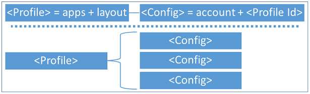
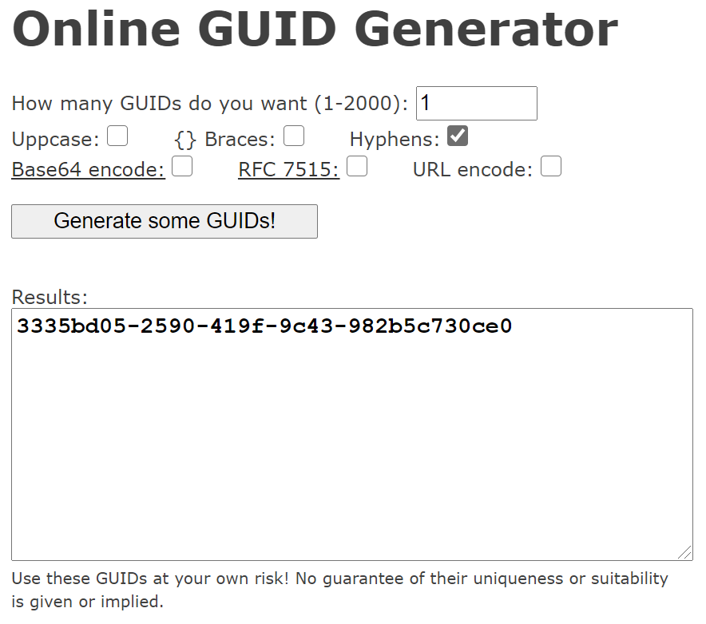
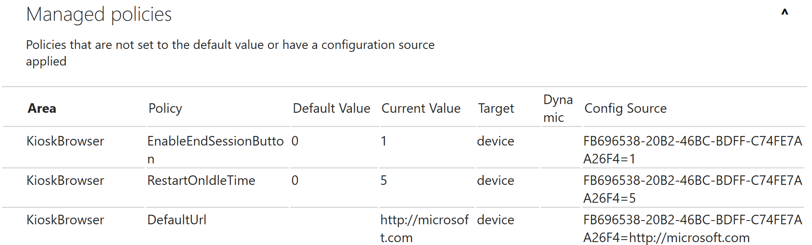
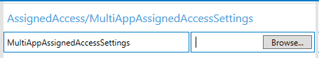
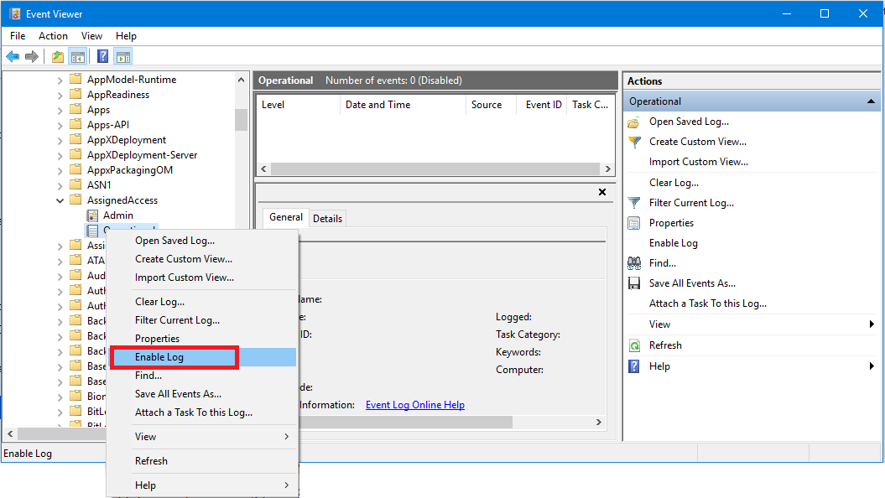
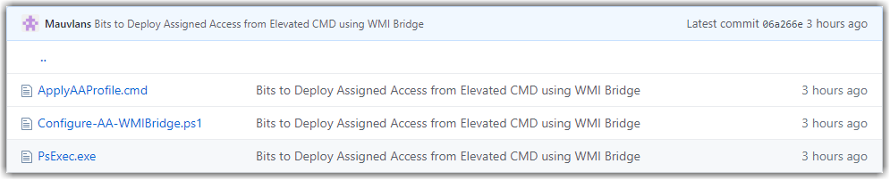

|--------------------------------------------|

We hope you find value in the contents of this domo walkthrough. The contents
are a compilation of items created by the authors of this session, Session
Members, as well as Microsoft Docs. Leverage the links provided through this
guide for updated content and tutorials.

Create the Configuration XML

<https://docs.microsoft.com/en-us/windows/configuration/lock-down-windows-10-to-specific-apps#create-xml-file>

The basic structure for an Assigned Access configuration XML includes the
following elements:

-   A configuration xml can define multiple profiles. Each profile has a unique
    Id and defines a set of applications that are allowed to run, whether the
    taskbar is visible, and can include a custom Start layout.

-   A configuration xml can have multiple config sections. Each config section
    associates a non-admin user account to a default profile Id.

-   Multiple config sections can be associated to the same profile.

-   A profile has no effect if it’s not associated to a config section.

>   profile = app and config = account

### Profiles Tag

There are two types of profiles that you can define in the configuration XML:

-   **Lockdown profile**. Users assigned a lockdown profile will see the desktop
    in tablet mode with the specific apps on the Start screen. This profile type
    contains the following tags:

    -   Id

    -   AllowedApps

    -   FileExplorerNamespaceRetrictions

    -   StartLayout

    -   Taskbar

-   **Kiosk profile**. New in Windows 10, version 1803, this profile replaces
    the KioskModeApp node of the AssignedAccess CSP. Users assigned a kiosk
    profile will not see the desktop, but only the kiosk app running in
    full-screen mode. This profile type contains the following tags:

    -   Id

    -   KioskModeApp

### Online GUID Generator

The profile Id is a GUID attribute to uniquely identify the profile. You can
create a GUID using a GUID generator. The GUID just needs to be unique within
this XML file. For example, you can use: <https://www.guidgenerator.com/>

### Configs Tag

Under Configs, define which user account will be associated with the profile.
When this user account signs in on the device, the associated assigned access
profile will be enforced, including the allowed apps, Start layout, and taskbar
configuration, as well as other local group policies or mobile device management
(MDM) policies set as part of the multi-app experience.

The full multi-app assigned access experience can only work for non-admin users.
It’s not supported to associate an admin user with the assigned access profile;
doing this in the XML file will result in unexpected/unsupported experiences
when this admin user signs in.

### OS Namespace

To authorize a compatible configuration XML that includes elements and
attributes from Windows 10, version 1809 or newer, always include the namespace
of these add-on schemas, and decorate the attributes and elements accordingly
with the namespace alias. For example, to configure the auto-launch feature
which is added in Windows 10, version 1809, use the following sample. Notice an
alias r1809 is given to the 201810 namespace for Windows 10, version 1809, and
the alias is tagged on AutoLaunch and AutoLaunchArguments inline.

\<AssignedAccessConfiguration

    xmlns="http://schemas.microsoft.com/AssignedAccess/2017/config"

    xmlns:r1809="http://schemas.microsoft.com/AssignedAccess/201810/config"

\>

    \<Profiles\>

        \<Profile Id="{9A2A490F-10F6-4764-974A-43B19E722C23}"\>

            \<AllAppsList\>

                \<AllowedApps\>

                  \<App DesktopAppPath="%SystemRoot%\\system32\\notepad.exe" r1809:AutoLaunch="true" r1809:AutoLaunchArguments="1.txt"/\>

Configure Single App XML

The profile section of a single app configuration XML contains 2 tags:

-   **Id** The profile Id is a GUID attribute to uniquely identify the profile.
    You can create a GUID using a GUID generator. The GUID just needs to be
    unique within this XML file.

-   **KioskModeApp** KioskModeApp is used for a kiosk profile only. Enter the
    App User Model ID (AUMID) for a single app. You can only specify one kiosk
    profile in the XML.

    -   You can find the AUMID for specific apps using the following PowerShell
        cmdlet:

        **Get-StartApps**

    -   For additional methods refer to:
        <https://docs.microsoft.com/en-us/windows/configuration/find-the-application-user-model-id-of-an-installed-app>

### Sample single app XML

\<?xml version="1.0" encoding="utf-8" ?\>

\<AssignedAccessConfiguration

    xmlns="http://schemas.microsoft.com/AssignedAccess/2017/config"

    xmlns:rs5="http://schemas.microsoft.com/AssignedAccess/201810/config"

    \>

    \<Profiles\>

        \<Profile Id="{AFF9DA33-AE89-4039-B646-3A5706E92957}"\>

            \<KioskModeApp AppUserModelId="Microsoft.WindowsCalculator_8wekyb3d8bbwe!App"/\>

        \</Profile\>

    \</Profiles\>

    \<Configs\>

        \<Config\>

            \<Account\>singleappuser\</Account\>

            \<DefaultProfile Id="{AFF9DA33-AE89-4039-B646-3A5706E92957}"/\>

        \</Config\>

    \</Configs\>

\</AssignedAccessConfiguration\>

Configure Multi App XML

The profile section of a multi app configuration XML can contain up to 5 tags:

-   **Id** The profile Id is a GUID attribute to uniquely identify the profile.
    You can create a GUID using a GUID generator. The GUID just needs to be
    unique within this XML file.

-   **AllowedApps** AllowedApps is a list of applications that are allowed to
    run. Apps can be Universal Windows Platform (UWP) apps or Windows desktop
    applications. In Windows 10, version 1809, you can configure a single app in
    the AllowedApps list to run automatically when the assigned access user
    account signs in.

-   **FileExplorerNamespaceRestrictions** Starting in Windows 10, version 1809,
    you can explicitly allow some known folders to be accessed when the user
    tries to open the file dialog box in multi-app assigned access by including
    FileExplorerNamespaceRestrictions in your XML file. Currently, Downloads is
    the only folder supported. This can also be set using Microsoft Intune.

-   **StartLayout** After you define the list of allowed applications, you can
    customize the Start layout for your kiosk experience. You can choose to pin
    all the allowed apps on the Start screen or just a subset, depending on
    whether you want the end user to directly access them on the Start screen.
    The easiest way to create a customized Start layout to apply to other
    Windows 10 devices is to set up the Start screen on a test device and then
    export the layout using the PowerShell cmdlet **Export-StartLayout –path
    \<path\>\<file name\>.xml**.

-   **Taskbar** Define whether you want to have the taskbar present in the kiosk
    device. For tablet-based or touch-enabled all-in-one kiosks, when you don’t
    attach a keyboard and mouse, you can hide the taskbar as part of the
    multi-app experience if you want.

### Sample multi app XML

\<?xml version="1.0" encoding="utf-8" ?\>

\<AssignedAccessConfiguration

    xmlns="https://schemas.microsoft.com/AssignedAccess/2017/config"

    xmlns:v2="https://schemas.microsoft.com/AssignedAccess/201810/config"

    xmlns:v3="https://schemas.microsoft.com/AssignedAccess/2020/config"

\>

    \<Profiles\>

        \<Profile Id="{9A2A490F-10F6-4764-974A-43B19E722C23}"\>

            \<AllAppsList\>

                \<AllowedApps\>

                    \<App AppUserModelId="Microsoft.ZuneMusic_8wekyb3d8bbwe!Microsoft.ZuneMusic" /\>

                    \<App AppUserModelId="Microsoft.ZuneVideo_8wekyb3d8bbwe!Microsoft.ZuneVideo" /\>

                    \<App AppUserModelId="Microsoft.Windows.Photos_8wekyb3d8bbwe!App" /\>

                    \<App AppUserModelId="Microsoft.BingWeather_8wekyb3d8bbwe!App" /\>

                    \<App AppUserModelId="Microsoft.WindowsCalculator_8wekyb3d8bbwe!App" /\>

                \</AllowedApps\>

            \</AllAppsList\>

            \<StartLayout\>

                \<![CDATA[\<LayoutModificationTemplate xmlns:defaultlayout="https://schemas.microsoft.com/Start/2014/FullDefaultLayout" xmlns:start="https://schemas.microsoft.com/Start/2014/StartLayout" Version="1" xmlns="httsp://schemas.microsoft.com/Start/2014/LayoutModification"\>

                            \<LayoutOptions StartTileGroupCellWidth="6" /\>

                            \<DefaultLayoutOverride\>

                                \<StartLayoutCollection\>

                                \<defaultlayout:StartLayout GroupCellWidth="6"\>

                                    \<start:Group Name="Group1"\>

                                    \<start:Tile Size="4x4" Column="0" Row="0" AppUserModelID="Microsoft.ZuneMusic_8wekyb3d8bbwe!Microsoft.ZuneMusic" /\>

                                    \<start:Tile Size="2x2" Column="4" Row="2" AppUserModelID="Microsoft.ZuneVideo_8wekyb3d8bbwe!Microsoft.ZuneVideo" /\>

                                    \<start:Tile Size="2x2" Column="4" Row="0" AppUserModelID="Microsoft.Windows.Photos_8wekyb3d8bbwe!App" /\>

                                    \<start:Tile Size="2x2" Column="4" Row="4" AppUserModelID="Microsoft.BingWeather_8wekyb3d8bbwe!App" /\>

                                    \<start:Tile Size="4x2" Column="0" Row="4" AppUserModelID="Microsoft.WindowsCalculator_8wekyb3d8bbwe!App" /\>

                                    \</start:Group\>

                                    \<start:Group Name="Group2"\>

                                    \<start:DesktopApplicationTile Size="2x2" Column="2" Row="0" DesktopApplicationLinkPath="%ALLUSERSPROFILE%\\Microsoft\\Windows\\Start Menu\\Programs\\Accessories\\Paint.lnk" /\>

                                    \<start:DesktopApplicationTile Size="2x2" Column="0" Row="0" DesktopApplicationLinkPath="%APPDATA%\\Microsoft\\Windows\\Start Menu\\Programs\\Accessories\\Notepad.lnk" /\>

                                    \</start:Group\>

                                \</defaultlayout:StartLayout\>

                                \</StartLayoutCollection\>

                            \</DefaultLayoutOverride\>

                            \</LayoutModificationTemplate\>

                        ]]\>

            \</StartLayout\>

            \<Taskbar ShowTaskbar="true"/\>

        \</Profile\>

    \</Profiles\>

    \<Configs\>

        \<Config\>

            \<Account\>MultiAppKioskUser\</Account\>

            \<DefaultProfile Id="{9A2A490F-10F6-4764-974A-43B19E722C23}"/\>

        \</Config\>

    \</Configs\>

\</AssignedAccessConfiguration\>

Deliver Assigned Access XML via Intune

Create the profile

1.  Sign in to the [Microsoft Endpoint Manager admin
    center](https://go.microsoft.com/fwlink/?linkid=2109431).

2.  Select **Devices** \> **Configuration profiles** \> **Create profile**.

3.  Enter the following properties:

    -   **Name**: Enter a descriptive name for the new profile.

    -   **Description**: Enter a description for the profile. This setting is
        optional but recommended.

    -   **Platform**: Select **Windows 10 and later**

    -   **Profile type**: Select **Kiosk**

4.  In **Settings**, select a **kiosk mode**. **Kiosk mode** identifies the type
    of kiosk mode supported by the policy. Options include:

    -   **Not Configured** (default): The policy doesn't enable kiosk mode.

    -   **Single app, full-screen kiosk**: The device runs as a single user
        account, and locks it to a single Store app. So when the user signs in,
        a specific app starts. This mode also restricts the user from opening
        new apps, or changing the running app.

    -   **Multi app kiosk**: The device runs multiple Store apps, Win32 apps, or
        inbox Windows apps by using the Application User Model ID (AUMID). Only
        the apps you add are available on the device.  
        The benefit of a multi-app kiosk, or fixed-purpose device, is to provide
        an easy-to-understand experience for users by only accessing apps they
        need. And, also removing from their view the apps they don’t need.  
        For a list of all settings, and what they do, see:

    -   [Windows 10 kiosk
        settings](https://docs.microsoft.com/en-us/intune/configuration/kiosk-settings-windows)

    -   [Windows Holographic for Business kiosk
        settings](https://docs.microsoft.com/en-us/intune/configuration/kiosk-settings-holographic)

5.  When you're done, select **OK** \> **Create** to save your changes.

The profile is created and shown in the profiles list.
Next, [assign](https://docs.microsoft.com/en-us/intune/configuration/device-profile-assign) the
profile.

### Verify profile assignment

1.  Open Settings \> Accounts \> Access school or work \> \<account\> \> Info.

2.  Scroll down to Advanced Diagnostic Report and click **Create Report** \>
    **Export**.

3.  Browse to C:\\Users\\Public\\Documents\\MDMDiagnostics and open
    **MDMDiagReport.html**.

4.  Scroll down to **Managed policies** and search for the desired settings by
    name.

Deliver Assigned Access XML via WMI Bridge

Environments that use [Windows Management Instrumentation
(WMI)](https://msdn.microsoft.com/library/aa394582.aspx) can use the [MDM Bridge
WMI
Provider](https://msdn.microsoft.com/library/windows/desktop/dn905224.aspx) to
configure the MDM_AssignedAccess class. See [PowerShell Scripting with WMI
Bridge
Provider](https://msdn.microsoft.com/windows/hardware/commercialize/customize/mdm/using-powershell-scripting-with-the-wmi-bridge-provider) for
more details about using a PowerShell script to configure AssignedAccess.

\$nameSpaceName="root\\cimv2\\mdm\\dmmap"

\$className="MDM_AssignedAccess"

\$obj = Get-CimInstance -Namespace \$namespaceName -ClassName \$className

Add-Type -AssemblyName System.Web

\$obj.Configuration = [System.Web.HttpUtility]::HtmlEncode(\@"

\<?xml version="1.0" encoding="utf-8" ?\>

\<AssignedAccessConfiguration xmlns="http://schemas.microsoft.com/AssignedAccess/2017/config"\>

  \<Profiles\>

    \<Profile Id="{9A2A490F-10F6-4764-974A-43B19E722C23}"\>

      \<AllAppsList\>

        \<AllowedApps\>

          \<App AppUserModelId="Microsoft.ZuneMusic_8wekyb3d8bbwe!Microsoft.ZuneMusic" /\>

          \<App AppUserModelId="Microsoft.ZuneVideo_8wekyb3d8bbwe!Microsoft.ZuneVideo" /\>

          \<App AppUserModelId="Microsoft.Windows.Photos_8wekyb3d8bbwe!App" /\>

          \<App AppUserModelId="Microsoft.BingWeather_8wekyb3d8bbwe!App" /\>

          \<App AppUserModelId="Microsoft.WindowsCalculator_8wekyb3d8bbwe!App" /\>

          \<App DesktopAppPath="%windir%\\system32\\mspaint.exe" /\>

          \<App DesktopAppPath="C:\\Windows\\System32\\notepad.exe" /\>

        \</AllowedApps\>

      \</AllAppsList\>

      \<StartLayout\>

        \<![CDATA[\<LayoutModificationTemplate xmlns:defaultlayout="http://schemas.microsoft.com/Start/2014/FullDefaultLayout" xmlns:start="http://schemas.microsoft.com/Start/2014/StartLayout" Version="1" xmlns="http://schemas.microsoft.com/Start/2014/LayoutModification"\>

                      \<LayoutOptions StartTileGroupCellWidth="6" /\>

                      \<DefaultLayoutOverride\>

                        \<StartLayoutCollection\>

                          \<defaultlayout:StartLayout GroupCellWidth="6"\>

                            \<start:Group Name="Group1"\>

                              \<start:Tile Size="4x4" Column="0" Row="0" AppUserModelID="Microsoft.ZuneMusic_8wekyb3d8bbwe!Microsoft.ZuneMusic" /\>

                              \<start:Tile Size="2x2" Column="4" Row="2" AppUserModelID="Microsoft.ZuneVideo_8wekyb3d8bbwe!Microsoft.ZuneVideo" /\>

                              \<start:Tile Size="2x2" Column="4" Row="0" AppUserModelID="Microsoft.Windows.Photos_8wekyb3d8bbwe!App" /\>

                              \<start:Tile Size="2x2" Column="4" Row="4" AppUserModelID="Microsoft.BingWeather_8wekyb3d8bbwe!App" /\>

                              \<start:Tile Size="4x2" Column="0" Row="4" AppUserModelID="Microsoft.WindowsCalculator_8wekyb3d8bbwe!App" /\>

                            \</start:Group\>

                            \<start:Group Name="Group2"\>

                              \<start:DesktopApplicationTile Size="2x2" Column="2" Row="0" DesktopApplicationLinkPath="%ALLUSERSPROFILE%\\Microsoft\\Windows\\Start Menu\\Programs\\Accessories\\Paint.lnk" /\>

                              \<start:DesktopApplicationTile Size="2x2" Column="0" Row="0" DesktopApplicationLinkPath="%APPDATA%\\Microsoft\\Windows\\Start Menu\\Programs\\Accessories\\Notepad.lnk" /\>

                            \</start:Group\>

                          \</defaultlayout:StartLayout\>

                        \</StartLayoutCollection\>

                      \</DefaultLayoutOverride\>

                    \</LayoutModificationTemplate\>

                ]]\>

      \</StartLayout\>

      \<Taskbar ShowTaskbar="true"/\>

    \</Profile\>

  \</Profiles\>

  \<Configs\>

    \<Config\>

      \<Account\>MultiAppKioskUser\</Account\>

      \<DefaultProfile Id="{9A2A490F-10F6-4764-974A-43B19E722C23}"/\>

    \</Config\>

  \</Configs\>

\</AssignedAccessConfiguration\>

"\@)

Set-CimInstance -CimInstance \$obj

Deliver Assigned Access XML via WICD

**Add XML file to provisioning package**

Before you add the XML file to a provisioning package, you can [validate your
configuration XML against the
XSD](https://docs.microsoft.com/en-us/windows/configuration/kiosk-xml#xsd-for-assignedaccess-configuration-xml).

Use the Windows Configuration Designer tool to create a provisioning
package. [Learn how to install Windows Configuration
Designer.](https://docs.microsoft.com/en-us/windows/configuration/provisioning-packages/provisioning-install-icd)

** Important**

When you build a provisioning package, you may include sensitive information in
the project files and in the provisioning package (.ppkg) file. Although you
have the option to encrypt the .ppkg file, project files are not encrypted. You
should store the project files in a secure location and delete the project files
when they are no longer needed.

1.  Open Windows Configuration Designer (by default, %systemdrive%\\Program
    Files (x86)\\Windows Kits\\10\\Assessment and Deployment Kit\\Imaging and
    Configuration Designer\\x86\\ICD.exe).

2.  Choose **Advanced provisioning**.

3.  Name your project, and click **Next**.

4.  Choose **All Windows desktop editions** and click **Next**.

5.  On **New project**, click **Finish**. The workspace for your package opens.

6.  Expand **Runtime
    settings** \> **AssignedAccess** \> **MultiAppAssignedAccessSettings**.

7.  In the center pane, click **Browse** to locate and select the assigned
    access configuration XML file that you created.

1.  (**Optional**: If you want to apply the provisioning package after device
    initial setup and there is an admin user already available on the kiosk
    device, skip this step.) Create an admin user account in **Runtime
    settings** \> **Accounts** \> **Users**. Provide
    a **UserName** and **Password**, and
    select **UserGroup** as **Administrators**. With this account, you can view
    the provisioning status and logs if needed.

2.  (**Optional**: If you already have a non-admin account on the kiosk device,
    skip this step.) Create a local standard user account in **Runtime
    settings** \> **Accounts** \> **Users**. Make sure the **UserName** is the
    same as the account that you specify in the configuration XML.
    Select **UserGroup** as **Standard Users**.

3.  On the **File** menu, select **Save.**

4.  On the **Export** menu, select **Provisioning package**.

5.  Change **Owner** to **IT Admin**, which will set the precedence of this
    provisioning package higher than provisioning packages applied to this
    device from other sources, and then select **Next.**

6.  Optional. In the **Provisioning package security** window, you can choose to
    encrypt the package and enable package signing.

    -   **Enable package encryption** - If you select this option, an
        auto-generated password will be shown on the screen.

    -   **Enable package signing** - If you select this option, you must select
        a valid certificate to use for signing the package. You can specify the
        certificate by clicking **Browse** and choosing the certificate you want
        to use to sign the package.

7.  Click **Next** to specify the output location where you want the
    provisioning package to go when it's built. By default, Windows Imaging and
    Configuration Designer (ICD) uses the project folder as the output location.

Optionally, you can click **Browse** to change the default output location.

1.  Click **Next**.

2.  Click **Build** to start building the package. The provisioning package
    doesn't take long to build. The project information is displayed in the
    build page and the progress bar indicates the build status.

If you need to cancel the build, click **Cancel**. This cancels the current
build process, closes the wizard, and takes you back to the **Customizations
Page**.

1.  If your build fails, an error message will show up that includes a link to
    the project folder. You can scan the logs to determine what caused the
    error. Once you fix the issue, try building the package again.

If your build is successful, the name of the provisioning package, output
directory, and project directory will be shown.

-   If you choose, you can build the provisioning package again and pick a
    different path for the output package. To do this, click **Back** to change
    the output package name and path, and then click **Next** to start another
    build.

-   If you are done, click **Finish** to close the wizard and go back to
    the **Customizations Page**.

1.  Copy the provisioning package to the root directory of a USB drive.

Troubleshooting Assigned Access

**Source:**
<https://docs.microsoft.com/en-us/windows/configuration/kiosk-troubleshoot>

**Single-app kiosk issues**

** Tip**

We recommend that you [enable logging for kiosk
issues](https://docs.microsoft.com/en-us/windows/configuration/kiosk-prepare#enable-logging).
For some failures, events are only captured once. If you enable logging after an
issue occurs with your kiosk, the logs may not capture those one-time events. In
that case, prepare a new kiosk environment (such as a [virtual machine
(VM)](https://docs.microsoft.com/en-us/windows/configuration/kiosk-prepare#test-vm)),
set up your kiosk account and configuration, and try to reproduce the problem.

**Sign-in issues**

1.  Verify that User Account Control (UAC) is turned on.

2.  Check the Event Viewer logs for sign-in issues under **Applications and
    Services Logs\\Microsoft\\Windows\\Authentication User
    Interface\\Operational**.

**Automatic logon issues**

Check the Event Viewer logs for auto logon issues under **Applications and
Services Logs\\Microsoft\\Windows\\Authentication User Interface\\Operational**.

**Multi-app kiosk issues**

**Unexpected results**

For example:

-   Start is not launched in full-screen

-   Blocked hotkeys are allowed

-   Task Manager, Cortana, or Settings can be launched

-   Start layout has more apps than expected

**Troubleshooting steps**

1.  [Verify that the provisioning package is applied
    successfully](https://docs.microsoft.com/en-us/windows/configuration/kiosk-validate).

2.  Verify that the account (config) is mapped to a profile in the configuration
    XML file.

3.  Verify that the configuration XML file is authored and formatted correctly.
    Correct any configuration errors, then create and apply a new provisioning
    package. Sign out and sign in again to check the new configuration.

4.  Additional logs about configuration and runtime issues can be obtained by
    enabling the **Applications and Services
    Logs\\Microsoft\\Windows\\AssignedAccess\\Operational** channel, which is
    disabled by default.

**Automatic logon issues**

Check the Event Viewer logs for auto logon issues under **Applications and
Services Logs\\Microsoft\\Windows\\Authentication User Interface\\Operational**.

**Apps configured in AllowedList are blocked**

1.  Ensure the account is mapped to the correct profile and that the apps are
    specific for that profile.

2.  Check the EventViewer logs for Applocker and AppxDeployment
    (under **Application and Services Logs\\Microsoft\\Windows**).

**Start layout not as expected**

-   Make sure the Start layout is authored correctly. Ensure that the
    attributes **Size**, **Row**, and **Column** are specified for each
    application and are valid.

-   Check if the apps included in the Start layout are installed for the
    assigned access user.

-   Check if the shortcut exists on the target device, if a desktop app is
    missing on Start.

Assigned Access Configuration XML Samples

For additional XML samples, refer to:
<https://docs.microsoft.com/en-us/windows/configuration/kiosk-xml>

### Single app XML

\<?xml version="1.0" encoding="utf-8" ?\>

\<AssignedAccessConfiguration

    xmlns="http://schemas.microsoft.com/AssignedAccess/2017/config"

    xmlns:rs5="http://schemas.microsoft.com/AssignedAccess/201810/config"

    \>

    \<Profiles\>

        \<Profile Id="{AFF9DA33-AE89-4039-B646-3A5706E92957}"\>

            \<KioskModeApp AppUserModelId="Microsoft.WindowsCalculator_8wekyb3d8bbwe!App"/\>

        \</Profile\>

    \</Profiles\>

    \<Configs\>

        \<Config\>

            \<Account\>singleappuser\</Account\>

            \<DefaultProfile Id="{AFF9DA33-AE89-4039-B646-3A5706E92957}"/\>

        \</Config\>

    \</Configs\>

\</AssignedAccessConfiguration\>

### Multi app, multi profile XML

\<?xml version="1.0" encoding="utf-8" ?\>

\<AssignedAccessConfiguration 

    xmlns="http://schemas.microsoft.com/AssignedAccess/2017/config"

    xmlns:rs5="http://schemas.microsoft.com/AssignedAccess/201810/config"

    \>

    \<Profiles\>

        \<Profile Id="{9A2A490F-10F6-4764-974A-43B19E722C23}"\>

            \<AllAppsList\>

                \<AllowedApps\>

                    \<App AppUserModelId="Microsoft.Microsoft3DViewer_8wekyb3d8bbwe!Microsoft.Microsoft3DViewer" /\>

                    \<App AppUserModelId="Microsoft.MicrosoftSolitaireCollection_8wekyb3d8bbwe!App" /\>

                    \<App AppUserModelId="Microsoft.MicrosoftStickyNotes_8wekyb3d8bbwe!App" /\>

                    \<App AppUserModelId="Microsoft.MSPaint_8wekyb3d8bbwe!Microsoft.MSPaint" /\>

                    \<App AppUserModelId="Microsoft.WindowsAlarms_8wekyb3d8bbwe!App" /\>

                    \<App AppUserModelId="microsoft.windowscommunicationsapps_8wekyb3d8bbwe!microsoft.windowsLive.calendar" /\>

                    \<App AppUserModelId="Microsoft.WindowsStore_8wekyb3d8bbwe!App" /\>

                    \<App DesktopAppPath="%SystemRoot%\\system32\\mspaint.exe" /\>

                    \<App DesktopAppPath="%SystemDrive%\\LOB\\MyLOB.exe" /\>

                \</AllowedApps\>

            \</AllAppsList\>

            \<rs5:FileExplorerNamespaceRestrictions\>

                \<rs5:AllowedNamespace Name="Downloads"/\>

            \</rs5:FileExplorerNamespaceRestrictions\>

            \<StartLayout\>

                \<![CDATA[\<LayoutModificationTemplate xmlns:defaultlayout="http://schemas.microsoft.com/Start/2014/FullDefaultLayout" xmlns:start="http://schemas.microsoft.com/Start/2014/StartLayout" Version="1" xmlns="http://schemas.microsoft.com/Start/2014/LayoutModification"\>

                      \<LayoutOptions StartTileGroupCellWidth="6" /\>

                      \<DefaultLayoutOverride\>

                        \<StartLayoutCollection\>

                          \<defaultlayout:StartLayout GroupCellWidth="6"\>

                            \<start:Group Name="Life at a glance"\>

                              \<start:Tile Size="2x2" Column="0" Row="0" AppUserModelID="microsoft.windowscommunicationsapps_8wekyb3d8bbwe!microsoft.windowsLive.calendar" /\>

                              \<start:Tile Size="4x2" Column="0" Row="4" AppUserModelID="Microsoft.WindowsStore_8wekyb3d8bbwe!App" /\>

                              \<!-- A link file is required for desktop applications to show on start layout, the link file can be placed under

                                   "%AllUsersProfile%\\Microsoft\\Windows\\Start Menu\\Programs" if the link file is shared for all users or

                                   "%AppData%\\Microsoft\\Windows\\Start Menu\\Programs" if the link file is for the specific user only 

                                   see document https://docs.microsoft.com/windows/configuration/start-layout-xml-desktop

                              --\>

                              \<!-- for inbox desktop applications, a link file might already exist and can be used directly --\>

                              \<start:DesktopApplicationTile Size="2x2" Column="2" Row="0" DesktopApplicationLinkPath="%AllUsersProfile%\\Microsoft\\Windows\\Start Menu\\Programs\\Accessories\\paint.lnk" /\>

                              \<!-- for 3rd party desktop application, place the link file under appropriate folder --\>

                              \<start:DesktopApplicationTile Size="2x2" Column="4" Row="0" DesktopApplicationLinkPath="%AppData%\\Microsoft\\Windows\\Start Menu\\Programs\\MyLOB.lnk" /\>

                            \</start:Group\>

                          \</defaultlayout:StartLayout\>

                        \</StartLayoutCollection\>

                      \</DefaultLayoutOverride\>

                    \</LayoutModificationTemplate\>

                ]]\>

            \</StartLayout\>

            \<Taskbar ShowTaskbar="true"/\>

        \</Profile\>

        \<Profile Id="{5B328104-BD89-4863-AB27-4ED6EE355485}"\>

            \<AllAppsList\>

                \<AllowedApps\>

                    \<App AppUserModelId="Microsoft.BingWeather_8wekyb3d8bbwe!App" /\>

                    \<App AppUserModelId="Microsoft.MicrosoftEdge_8wekyb3d8bbwe!BCHost" /\>

                    \<App AppUserModelId="Microsoft.MicrosoftEdge_8wekyb3d8bbwe!ContentProcess" /\>

                    \<App AppUserModelId="Microsoft.MicrosoftEdge_8wekyb3d8bbwe!F12" /\>

                    \<App AppUserModelId="Microsoft.MicrosoftEdge_8wekyb3d8bbwe!MicrosoftEdge" /\>

                    \<App AppUserModelId="Microsoft.MicrosoftEdge_8wekyb3d8bbwe!PdfReader" /\>

                    \<App DesktopAppPath="%SystemRoot%\\system32\\notepad.exe" rs5:AutoLaunch="true" rs5:AutoLaunchArguments="123.txt"/\>

                \</AllowedApps\>

            \</AllAppsList\>

            \<StartLayout\>

                \<![CDATA[\<LayoutModificationTemplate xmlns:defaultlayout="http://schemas.microsoft.com/Start/2014/FullDefaultLayout" xmlns:start="http://schemas.microsoft.com/Start/2014/StartLayout" Version="1" xmlns="http://schemas.microsoft.com/Start/2014/LayoutModification"\>

                      \<LayoutOptions StartTileGroupCellWidth="6" /\>

                      \<DefaultLayoutOverride\>

                        \<StartLayoutCollection\>

                          \<defaultlayout:StartLayout GroupCellWidth="6"\>

                            \<start:Group Name="Life at a glance"\>

                              \<start:Tile Size="2x2" Column="0" Row="0" AppUserModelID="Microsoft.BingWeather_8wekyb3d8bbwe!App" /\>

                              \<start:Tile Size="4x2" Column="0" Row="4" AppUserModelID="Microsoft.MicrosoftEdge_8wekyb3d8bbwe!MicrosoftEdge" /\>

                              \<start:DesktopApplicationTile Size="2x2" Column="2" Row="0" DesktopApplicationLinkPath="%AppData%\\Microsoft\\Windows\\Start Menu\\Programs\\Accessories\\notepad.lnk" /\>

                            \</start:Group\>

                          \</defaultlayout:StartLayout\>

                        \</StartLayoutCollection\>

                      \</DefaultLayoutOverride\>

                    \</LayoutModificationTemplate\>

                ]]\>

            \</StartLayout\>

            \<Taskbar ShowTaskbar="false"/\>

        \</Profile\>

    \</Profiles\>

    \<Configs\>

        \<Config\>

            \<Account\>domain\\account\</Account\>

            \<DefaultProfile Id="{9A2A490F-10F6-4764-974A-43B19E722C23}"/\>

        \</Config\>

        \<Config\>

            \<Account\>AzureAD\\john\@contoso.onmicrosoft.com\</Account\>

            \<DefaultProfile Id="{9A2A490F-10F6-4764-974A-43B19E722C23}"/\>

        \</Config\>

        \<Config\>

            \<Account\>localaccount\</Account\>

            \<DefaultProfile Id="{5B328104-BD89-4863-AB27-4ED6EE355485}"/\>

        \</Config\>

        \<Config\>

            \<AutoLogonAccount rs5:DisplayName="Hello World"/\>

            \<DefaultProfile Id="{5B328104-BD89-4863-AB27-4ED6EE355485}"/\>

        \</Config\>

        \<Config\>

            \<UserGroup Type="LocalGroup" Name="mygroup" /\>

            \<DefaultProfile Id="{5B328104-BD89-4863-AB27-4ED6EE355485}"/\>

        \</Config\>

        \<Config\>

            \<UserGroup Type="ActiveDirectoryGroup" Name="redmond\\somegroup" /\>

            \<DefaultProfile Id="{5B328104-BD89-4863-AB27-4ED6EE355485}"/\>

        \</Config\>

        \<Config\>

            \<UserGroup Type="AzureActiveDirectoryGroup" Name="a8d36e43-4180-4ac5-a627-fb8149bba1ac" /\>

            \<DefaultProfile Id="{5B328104-BD89-4863-AB27-4ED6EE355485}"/\>

        \</Config\>

    \</Configs\>

\</AssignedAccessConfiguration\>

Deploy Assigned Access

Deploying assigned access can be done using various methods this method we will
be downloading the necessary bits from GitHub and Deploying via WMI Bridge as
System using PSExec. We have put the logic together on get hub to provide a
foundation to get started.

<https://github.com/Mauvlans/AssignedAccess/tree/master/AA%20via%20WMI%20Bridge>

#### ApplyAAProfile.cmd:

The ApplyAAProfile.cmd script is to execute PSExec as an elevated process and
execute the PowerShell script which will apply our Assigned Access. This is
meant to be executed as admin, this is commonly done by right clicking and
selecting “Run as Administrator”

NOTE: this script is hard coded to be ran from a specified directory be sure to
take a few moments to update the

SET CurrentDir="%\~dp0"

cd %CurrentDir%

psexec.exe -i -s powershell.exe -ExecutionPolicy Bypass -File "c:\\Util\\aa\\Configure-AA-WMIBridge.ps1" 2\> Log.txt

#### Configure-AA-WMIBridge.ps1:

The Configure-AA-WMIBridge.ps1 script will take your assigned access XML profile
you can copy the entirety of the profile between the \@” and “\@. This will
apply the profile defined to the MDM AssignedAccess.

\$nameSpaceName="root\\cimv2\\mdm\\dmmap"

\$className="MDM_AssignedAccess"

\$obj = Get-CimInstance -Namespace \$namespaceName -ClassName \$className

Add-Type -AssemblyName System.Web

\$obj.Configuration = [System.Web.HttpUtility]::HtmlEncode(\@"

\<\<\< Assigned Access XML \>\>\>

"\@)

Set-CimInstance -CimInstance \$obj

#### PsExec.exe:

This is the PsExec bits as part of System Internals. You can use this or an
updated exe.

### Execution:

To execute,

1.  Copy the 3 files to a working directory on the local machines.

2.  Update the ApplyAAProfile.cmd to reflect the current working directory.

3.  Update the Configure-AA-WMIBridge.ps1 with the desired assigned access
    profile.

4.  Prep the underlying host with any necessary application, User Accounts,
    configurations.

5.  Apply the AA profile by running ApplyAAProfile.cmd as admin.

6.  Check the log.txt output in the execution directory for any errors.

7.  Logout and login as the AA user and validate profiles successfully applied.
